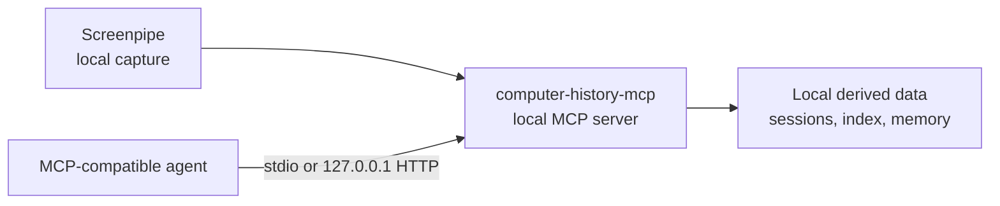

# computer-history-mcp

[English](README.md) | [简体中文](README.zh-CN.md)

[](https://nodejs.org/)
[](LICENSE)
[](https://xiaozhenliu.github.io/computer-history-mcp/guide/clients/generic-mcp)
[](https://xiaozhenliu.github.io/computer-history-mcp/)

**Open-source, local-first computer history and persistent memory for Codex, Claude, Cursor, Hermes, and other MCP-compatible AI agents.**

`computer-history-mcp` turns an MIT-licensed Screenpipe capture into searchable screen history, long-term memory, local file analysis, privacy controls, and runtime diagnostics exposed as standard [Model Context Protocol](https://modelcontextprotocol.io/) tools. It runs on your Mac, stores derived data locally, and serves MCP clients over a loopback-only Streamable HTTP endpoint.

Use it with any MCP-compatible client that can connect to `http://127.0.0.1:18765/mcp`. The onboarding flow also configures [Hermes](https://xiaozhenliu.github.io/computer-history-mcp/guide/clients/hermes) automatically.

## Why computer-history-mcp?

AI agents are more useful when they can recover context from your actual work without sending an unrestricted activity stream to a hosted service. `computer-history-mcp` keeps that memory layer local and exposes a focused MCP interface:

- Search for evidence fragments from captured screen activity.
- Recall work sessions and summarize bounded time windows.
- Inspect individual sessions or frames when an agent needs supporting detail.
- Persist user-approved long-term memory between conversations.
- Pause capture, exclude applications, or delete captured ranges locally.

## A local memory layer for computer-use agents

[Codex Computer Use](https://developers.openai.com/codex/use-cases/qa-your-app-with-computer-use) and similar tools can observe the current interface and act by clicking or typing. `computer-history-mcp` solves a different problem: it records and indexes work context over time so an agent can search or recall it later. It is a local, open-source alternative when you need **computer history and persistent agent memory**; it does not replace live UI control.

| Capability | `computer-history-mcp` | Codex Computer Use |
|---|---|---|
| Primary role | Search and recall past work context | Operate the current UI |
| Interaction | MCP tools for retrieval, memory, privacy, and routines | Screenshots plus click, type, scroll, and other UI actions |
| History | Persistent, queryable local index | Current task state and screenshots |
| Client support | Any compatible MCP client | Codex and supported OpenAI surfaces |
| Data boundary | Capture and derived index stay on the Mac by default | Local workflows run on-device; screenshots follow OpenAI product data controls |

The two can also work together: a computer-use agent can query `computer-history-mcp` for earlier context before acting in the current interface.

## Features

- **Local-first by design**: managed HTTP mode binds to `127.0.0.1`, and derived data stays under `~/.computer-history-mcp/`.
- **Work-activity retrieval**: use `find`, `recall`, and `inspect` for keyword, semantic, and hybrid retrieval workflows.
- **Persistent memory**: read and write local long-term memory with separate `memory` and `user` scopes.
- **Privacy controls**: pause and resume collection, exclude applications, delete time ranges, and launch Screenpipe with safer defaults.
- **Configurable OCR languages**: choose the recognition languages used by the recorder (`capture.ocrLanguages`) — defaults to English-only, set `[chinese, english]` for Chinese-primary capture. See [Configuration](https://xiaozhenliu.github.io/computer-history-mcp/reference/configuration).
- **Provider configuration**: use local Ollama by default when available, or configure any OpenAI-compatible embedding endpoint.
- **Operational visibility**: inspect capture health, ingestion mix, disk-budget warnings, and retrieval recovery status.
- **Two MCP transports**: use Streamable HTTP for the managed service or stdio for compatible local clients.
- **Prompt-driven routines**: schedule recurring tasks with a natural-language prompt and a cron expression — the executor retrieves relevant screen evidence and calls the configured LLM to produce tailored briefings. Falls back to a deterministic summary when no LLM is configured.
- **Dashboard Web UI**: a browser-based management panel for status monitoring, configuration, routines control, activity browsing, privacy management, and log viewing — accessible at `http://127.0.0.1:<port>/`.

## Quick Start

### Prerequisites

- macOS
- Node.js 22+
- The tested MIT release, `screenpipe@0.3.282`, with macOS Screen Recording and Accessibility permissions

Install the exact tested release and confirm that its executable is on `PATH`:

```bash
npm install --global screenpipe@0.3.282
screenpipe --version
```

The version command must report `screenpipe 0.3.282`. Do not substitute `screenpipe@latest`: current upstream releases use a different license and have not been validated with this project.

Install and start `computer-history-mcp`:

```bash
git clone https://github.com/xiaozhenliu/computer-history-mcp.git
cd computer-history-mcp
npm install
npm start
```

`npm start` is the only normal startup entry point. It detects first-time setup, missing build output, and an existing installation automatically. Depending on local state, it starts Screenpipe, runs onboarding, rebuilds missing artifacts, or resumes only the missing services.

The default MCP endpoint is:

```text
http://127.0.0.1:18765/mcp
```

For the complete first-run walkthrough, Screenpipe permissions, safer terminal capture defaults, and troubleshooting steps, see the [Quickstart guide](https://xiaozhenliu.github.io/computer-history-mcp/guide/quickstart).

## MCP Tools

The runtime registers twelve MCP tools:

| Tool | Purpose |
|------|---------|
| `find` | Search captured work-activity evidence by keyword, semantic similarity, or hybrid mode |
| `recall` | Recall sessions or aggregated time blocks for a bounded window |
| `inspect` | Drill into a session or frame and return supporting evidence |
| `memory-read` | Read persisted local long-term memory |
| `memory-write` | Append or replace persisted local long-term memory |
| `file-analyze` | Summarize or query a local text file |
| `privacy-control` | Check or modify local privacy controls |
| `screenpipe-control` | Check, start, or stop the local Screenpipe recording process |
| `internal-status` | Inspect runtime health, capture state, and retrieval recovery status |
| `routine-list` | List configured routines with schedule, enabled state, and latest run summary |
| `routine-create` | Create or update a routine with a prompt and cron schedule; look-back window is inferred from schedule frequency when omitted |
| `routine-history` | Retrieve recent execution history for a named routine, newest-first |

See the [MCP tools reference](https://xiaozhenliu.github.io/computer-history-mcp/reference/tools) for schemas and result contracts.

## Connect Your MCP Client

Point any Streamable HTTP-compatible MCP client at:

```text
http://127.0.0.1:18765/mcp
```

For Hermes, onboarding writes the client configuration automatically. Verify it with:

```bash
hermes mcp list
hermes mcp test computer-history-mcp
```

See [Generic MCP client setup](https://xiaozhenliu.github.io/computer-history-mcp/guide/clients/generic-mcp) and the [Hermes guide](https://xiaozhenliu.github.io/computer-history-mcp/guide/clients/hermes) for client-specific instructions.

## Architecture

`computer-history-mcp` is an independent MCP server with an embedded dashboard for local operators. It reads local Screenpipe data, builds a local derived index, and exposes a focused tool surface through stdio and Streamable HTTP. The dashboard web UI provides browser-based status monitoring and configuration management at the same HTTP endpoint.



Read the [architecture document](docs/architecture.md) for subsystem boundaries, storage paths, and runtime constraints.

## Documentation

Full documentation is available at **[xiaozhenliu.github.io/computer-history](https://xiaozhenliu.github.io/computer-history-mcp/)**.

| Document | What it covers |
|----------|----------------|
| [Quickstart](https://xiaozhenliu.github.io/computer-history-mcp/guide/quickstart) | First install, onboarding, and validation |
| [Configuration](https://xiaozhenliu.github.io/computer-history-mcp/reference/configuration) | Configuration fields and embedding providers |
| [Dashboard](https://xiaozhenliu.github.io/computer-history-mcp/reference/dashboard) | Web UI for status monitoring, config, routines, and logs |
| [MCP tools](https://xiaozhenliu.github.io/computer-history-mcp/reference/tools) | Tool schemas and result contracts |
| [Generic MCP client](https://xiaozhenliu.github.io/computer-history-mcp/guide/clients/generic-mcp) | Streamable HTTP client setup |
| [Hermes](https://xiaozhenliu.github.io/computer-history-mcp/guide/clients/hermes) | Hermes onboarding and verification |
| [Troubleshooting](https://xiaozhenliu.github.io/computer-history-mcp/guide/troubleshooting) | Service, provider, capture, and index recovery |
| [Architecture](docs/architecture.md) | Runtime layers, data flow, and local storage (repo-only) |

## Community

Contributions are welcome. Read the [contribution guide](CONTRIBUTING.md) before
opening an issue or pull request, and follow the
[Code of Conduct](CODE_OF_CONDUCT.md).

Report suspected vulnerabilities privately through the
[security policy](SECURITY.md). Do not open a public issue for a security
report.

## Development

```bash
npm install
npm run typecheck
npm run build
npm test
```

Useful local commands:

| Command | Purpose |
|---------|---------|
| `npm start` | State-aware startup for first installation, build recovery, and daily resume |
| `npm run onboard` | Advanced: force the interactive configuration and validation flow |
| `npm run resume` | Advanced: skip setup detection and resume an existing installation |
| `npm run refresh:hermes` | After source changes, rebuild and restart MCP, restore Screenpipe, and verify a real Hermes tool call |
| `npm run service:status` | Check managed service and MCP endpoint health |
| `npm run service:logs` | Tail managed service logs |
| `npm run up -- --detach` | Bring up the stack with the recorder running in the background |
| `npm run down:all` | Gracefully stop the recorder and the managed service in one command |
| `npm run recorder:start` | Start the Screenpipe recorder detached (logs to `recorder.log`) |
| `npm run recorder:status` | Report whether the background recorder is running |
| `npm run recorder:stop` | Gracefully stop the background recorder |
| `npm run recorder:logs` | Tail the background recorder log |
| `npm run rebuild-index` | Rebuild retrieval artifacts from local Screenpipe data |
| `npm run dev:stdio` | Run the MCP server over stdio |
| `npm run dev:http` | Run the MCP server over HTTP |

## License

Licensed under the [MIT License](LICENSE).
