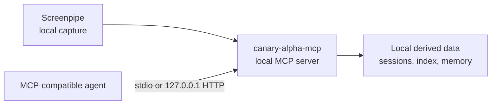

# canary-alpha-mcp

[English](README.md) | [简体中文](README.zh-CN.md)

[](https://nodejs.org/)
[](LICENSE)
[](https://xiaozhenliu.github.io/canary-alpha/guide/clients/generic-mcp)
[](https://xiaozhenliu.github.io/canary-alpha/)

**A local-first MCP server that turns your Screenpipe history into searchable, privacy-aware memory for AI agents.**

`canary-alpha-mcp` exposes captured work activity, long-term memory, local file analysis, privacy controls, and runtime diagnostics as standard [Model Context Protocol](https://modelcontextprotocol.io/) tools. It runs on your machine, stores derived data locally, and serves MCP clients over a loopback-only Streamable HTTP endpoint.

Use it with any MCP-compatible client that can connect to `http://127.0.0.1:18765/mcp`. The onboarding flow also configures [Hermes](https://xiaozhenliu.github.io/canary-alpha/guide/clients/hermes) automatically.

## Why canary-alpha-mcp?

AI agents are more useful when they can recover context from your actual work without sending an unrestricted activity stream to a hosted service. `canary-alpha-mcp` keeps that memory layer local and exposes a focused MCP interface:

- Search for evidence fragments from captured screen activity.
- Recall work sessions and summarize bounded time windows.
- Inspect individual sessions or frames when an agent needs supporting detail.
- Persist user-approved long-term memory between conversations.
- Pause capture, exclude applications, or delete captured ranges locally.

## Features

- **Local-first by design**: managed HTTP mode binds to `127.0.0.1`, and derived data stays under `~/.canary-alpha-mcp/`.
- **Work-activity retrieval**: use `find`, `recall`, and `inspect` for keyword, semantic, and hybrid retrieval workflows.
- **Persistent memory**: read and write local long-term memory with separate `memory` and `user` scopes.
- **Privacy controls**: pause and resume collection, exclude applications, delete time ranges, and launch Screenpipe with safer defaults.
- **Provider configuration**: use local Ollama by default when available, or configure any OpenAI-compatible embedding endpoint.
- **Operational visibility**: inspect capture health, ingestion mix, disk-budget warnings, and retrieval recovery status.
- **Two MCP transports**: use Streamable HTTP for the managed service or stdio for compatible local clients.

## Quick Start

### Prerequisites

- macOS
- Node.js 22+
- A running [Screenpipe](https://screenpi.pe/onboarding) installation

Launch Screenpipe and verify its local API:

```bash
curl http://localhost:3030/health
```

Then install and onboard `canary-alpha-mcp`:

```bash
git clone https://github.com/xiaozhenliu/canary-alpha.git
cd canary-alpha
npm install
npm run onboard
```

`npm run onboard` verifies Screenpipe, configures an embedding provider, writes `~/.canary-alpha-mcp/config.yaml`, builds the server, starts the managed service, validates the MCP endpoint, and registers the server with Hermes.

The default MCP endpoint is:

```text
http://127.0.0.1:18765/mcp
```

For the complete first-run walkthrough, Screenpipe permissions, safer terminal capture defaults, and troubleshooting steps, see the [Quickstart guide](https://xiaozhenliu.github.io/canary-alpha/guide/quickstart).

## MCP Tools

The runtime registers nine MCP tools:

| Tool | Purpose |
|------|---------|
| `find` | Search captured work-activity evidence by keyword, semantic similarity, or hybrid mode |
| `recall` | Recall sessions or aggregated time blocks for a bounded window |
| `inspect` | Drill into a session or frame and return supporting evidence |
| `memory-read` | Read persisted local long-term memory |
| `memory-write` | Append or replace persisted local long-term memory |
| `file-analyze` | Summarize or query a local text file |
| `privacy-control` | Check or modify local privacy controls |
| `screenpipe-control` | Check, start, or stop the local Screenpipe recording process |
| `internal-status` | Inspect runtime health, capture state, and retrieval recovery status |

See the [MCP tools reference](https://xiaozhenliu.github.io/canary-alpha/reference/tools) for schemas and result contracts.

## Connect Your MCP Client

Point any Streamable HTTP-compatible MCP client at:

```text
http://127.0.0.1:18765/mcp
```

For Hermes, onboarding writes the client configuration automatically. Verify it with:

```bash
hermes mcp list
hermes mcp test canary-alpha-mcp
```

See [Generic MCP client setup](https://xiaozhenliu.github.io/canary-alpha/guide/clients/generic-mcp) and the [Hermes guide](https://xiaozhenliu.github.io/canary-alpha/guide/clients/hermes) for client-specific instructions.

## Architecture

`canary-alpha-mcp` is an independent MCP server with no frontend. It reads local Screenpipe data, builds a local derived index, and exposes a focused tool surface through stdio and Streamable HTTP.



Read the [architecture document](docs/architecture.md) for subsystem boundaries, storage paths, and runtime constraints.

## Documentation

Full documentation is available at **[xiaozhenliu.github.io/canary-alpha](https://xiaozhenliu.github.io/canary-alpha/)**.

| Document | What it covers |
|----------|----------------|
| [Quickstart](https://xiaozhenliu.github.io/canary-alpha/guide/quickstart) | First install, onboarding, and validation |
| [Configuration](https://xiaozhenliu.github.io/canary-alpha/reference/configuration) | Configuration fields and embedding providers |
| [MCP tools](https://xiaozhenliu.github.io/canary-alpha/reference/tools) | Tool schemas and result contracts |
| [Generic MCP client](https://xiaozhenliu.github.io/canary-alpha/guide/clients/generic-mcp) | Streamable HTTP client setup |
| [Hermes](https://xiaozhenliu.github.io/canary-alpha/guide/clients/hermes) | Hermes onboarding and verification |
| [Troubleshooting](https://xiaozhenliu.github.io/canary-alpha/guide/troubleshooting) | Service, provider, capture, and index recovery |
| [Architecture](docs/architecture.md) | Runtime layers, data flow, and local storage (repo-only) |

## Community

Contributions are welcome. Read the [contribution guide](CONTRIBUTING.md) before
opening an issue or pull request, and follow the
[Code of Conduct](CODE_OF_CONDUCT.md).

Report suspected vulnerabilities privately through the
[security policy](SECURITY.md). Do not open a public issue for a security
report.

## Development

```bash
npm install
npm run typecheck
npm run build
npm test
```

Useful local commands:

| Command | Purpose |
|---------|---------|
| `npm run onboard` | Configure, build, start, and validate the managed local service |
| `npm run service:status` | Check managed service and MCP endpoint health |
| `npm run service:logs` | Tail managed service logs |
| `npm run up -- --detach` | Bring up the stack with the recorder running in the background |
| `npm run down:all` | Gracefully stop the recorder and the managed service in one command |
| `npm run recorder:start` | Start the Screenpipe recorder detached (logs to `recorder.log`) |
| `npm run recorder:status` | Report whether the background recorder is running |
| `npm run recorder:stop` | Gracefully stop the background recorder |
| `npm run recorder:logs` | Tail the background recorder log |
| `npm run rebuild-index` | Rebuild retrieval artifacts from local Screenpipe data |
| `npm run dev:stdio` | Run the MCP server over stdio |
| `npm run dev:http` | Run the MCP server over HTTP |

## License

Licensed under the [Apache License 2.0](LICENSE).
