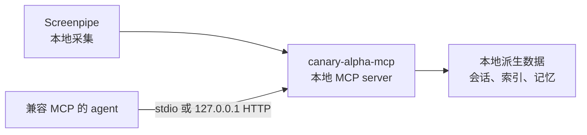

# canary-alpha-mcp

[English](README.md) | [简体中文](README.zh-CN.md)

[](https://nodejs.org/)
[](LICENSE)
[](docs/clients/generic-mcp.md)

**一个本地优先的 MCP server，把 Screenpipe 历史转化为可检索、可控制隐私的 AI agent 记忆。**

`canary-alpha-mcp` 将工作活动记录、长期记忆、本地文件分析、隐私控制和运行状态诊断封装成标准 [Model Context Protocol](https://modelcontextprotocol.io/) 工具。服务在本机运行，派生数据保存在本地，并通过仅监听回环地址的 Streamable HTTP 端点供 MCP 客户端调用。

任何兼容 MCP 且支持连接 `http://127.0.0.1:18765/mcp` 的客户端都可以使用它。初始化流程也会自动配置 [Hermes](docs/clients/hermes.md)。

## 为什么使用 canary-alpha-mcp？

当 AI agent 能够恢复真实工作上下文时，它会更有用；但这不代表必须把完整活动记录发送给托管服务。`canary-alpha-mcp` 把记忆层保留在本地，并提供聚焦的 MCP 接口：

- 从已捕获的屏幕活动中检索证据片段。
- 回顾工作会话，并汇总有限时间窗口。
- 在 agent 需要更多依据时，钻取具体会话或单帧内容。
- 在不同会话之间保存用户认可的长期记忆。
- 在本地暂停捕获、排除应用或删除指定时间范围的数据。

## 功能特性

- **本地优先设计**：托管 HTTP 模式仅绑定 `127.0.0.1`，派生数据保存在 `~/.canary-alpha-mcp/`。
- **工作活动检索**：通过 `find`、`recall` 和 `inspect` 完成关键词、语义和混合检索。
- **长期记忆持久化**：使用独立的 `memory` 和 `user` scope 读写本地记忆。
- **隐私控制**：暂停或恢复采集、排除应用、删除时间范围，并使用更安全的默认参数启动 Screenpipe。
- **Provider 配置化**：可用时默认使用本地 Ollama，也可以配置任意 OpenAI-compatible embedding endpoint。
- **运行状态可观测**：检查采集健康状态、摄取比例、磁盘预算告警和索引恢复状态。
- **两种 MCP transport**：托管服务使用 Streamable HTTP，也兼容 stdio 本地接入。

## 快速开始

### 环境要求

- macOS
- Node.js 22+
- 已安装并运行 [Screenpipe](https://screenpi.pe/onboarding)

启动 Screenpipe，并确认本地 API 正常：

```bash
curl http://localhost:3030/health
```

然后安装并初始化 `canary-alpha-mcp`：

```bash
git clone https://github.com/xiaozhenliu/canary-alpha.git
cd canary-alpha
npm install
npm run onboard
```

`npm run onboard` 会检查 Screenpipe、配置 embedding provider、写入 `~/.canary-alpha-mcp/config.yaml`、构建 MCP server、启动托管服务、验证 MCP endpoint，并把服务注册到 Hermes。

默认 MCP endpoint：

```text
http://127.0.0.1:18765/mcp
```

完整的首次安装流程、Screenpipe 权限说明、更安全的命令行采集默认值和故障排查步骤，请阅读[快速开始指南](docs/quickstart.md)。

## MCP 工具

运行时注册了 9 个 MCP tools：

| Tool | 用途 |
|------|------|
| `find` | 按关键词、语义相似度或混合模式检索工作活动证据 |
| `recall` | 回顾指定时间窗口内的会话或聚合时间块 |
| `inspect` | 钻取会话或单帧，并返回支撑证据 |
| `memory-read` | 读取本地持久化长期记忆 |
| `memory-write` | 追加或替换本地持久化长期记忆 |
| `file-analyze` | 汇总或查询本地文本文件 |
| `privacy-control` | 检查或修改本地隐私控制 |
| `screenpipe-control` | 检查、启动或停止本地 Screenpipe 录制进程 |
| `internal-status` | 检查运行健康状态、采集状态和索引恢复状态 |

输入 schema 和返回结果约定请阅读 [MCP 工具参考](docs/documentation/mcp-tools.md)。

## 连接 MCP 客户端

将任何兼容 Streamable HTTP 的 MCP 客户端指向：

```text
http://127.0.0.1:18765/mcp
```

对于 Hermes，初始化流程会自动写入客户端配置。可以运行以下命令验证：

```bash
hermes mcp list
hermes mcp test screenpipe-memory
```

其他客户端请参考[通用 MCP 客户端配置](docs/clients/generic-mcp.md)；Hermes 用户请参考 [Hermes 指南](docs/clients/hermes.md)。

## 架构

`canary-alpha-mcp` 是一个没有前端的独立 MCP server。它读取本地 Screenpipe 数据，构建本地派生索引，并通过 stdio 和 Streamable HTTP 暴露聚焦的工具接口。



子系统边界、存储路径和运行约束请阅读[架构文档](docs/architecture.md)。

## 文档导航

| 文档 | 内容 |
|------|------|
| [快速开始](docs/quickstart.md) | 首次安装、初始化与验证 |
| [配置参考](docs/documentation/configuration.md) | 配置字段与 embedding provider |
| [MCP 工具](docs/documentation/mcp-tools.md) | 工具 schema 与返回约定 |
| [通用 MCP 客户端](docs/clients/generic-mcp.md) | Streamable HTTP 客户端配置 |
| [Hermes](docs/clients/hermes.md) | Hermes 初始化与验证 |
| [故障排查](docs/troubleshooting.md) | 服务、provider、采集与索引恢复 |
| [架构](docs/architecture.md) | 运行分层、数据流和本地存储 |

## 社区

欢迎参与贡献。提交 issue 或 pull request 前，请先阅读
[贡献指南](CONTRIBUTING.md)，并遵守[行为准则](CODE_OF_CONDUCT.md)。

如需报告疑似安全漏洞，请根据[安全策略](SECURITY.md)私密提交。请勿为安全
问题创建公开 issue。

## 开发

```bash
npm install
npm run typecheck
npm run build
npm test
```

常用本地命令：

| 命令 | 用途 |
|------|------|
| `npm run onboard` | 配置、构建、启动并验证本地托管服务 |
| `npm run service:status` | 检查托管服务和 MCP endpoint 健康状态 |
| `npm run service:logs` | 查看托管服务日志 |
| `npm run rebuild-index` | 从本地 Screenpipe 数据重建检索索引 |
| `npm run dev:stdio` | 通过 stdio 运行 MCP server |
| `npm run dev:http` | 通过 HTTP 运行 MCP server |

## License

本项目使用 [Apache License 2.0](LICENSE)。
