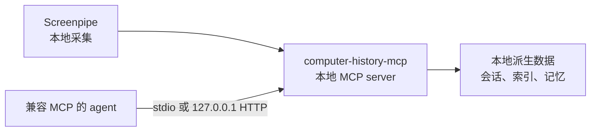

# computer-history-mcp

[English](README.md) | [简体中文](README.zh-CN.md)

[](https://nodejs.org/)
[](LICENSE)
[](https://xiaozhenliu.github.io/computer-history-mcp/guide/clients/generic-mcp)
[](https://xiaozhenliu.github.io/computer-history-mcp/zh/)

**面向 Codex、Claude、Cursor、Hermes 及其他 MCP AI agent 的开源、本地优先电脑历史与持久记忆服务。**

`computer-history-mcp` 把 MIT 许可的 Screenpipe 采集转化为可搜索的屏幕历史、长期记忆、本地文件分析、隐私控制和运行状态诊断，并封装成标准 [Model Context Protocol](https://modelcontextprotocol.io/) 工具。服务在 Mac 本机运行，派生数据保存在本地，并通过仅监听回环地址的 Streamable HTTP 端点供 MCP 客户端调用。

任何兼容 MCP 且支持连接 `http://127.0.0.1:18765/mcp` 的客户端都可以使用它。初始化流程也会自动配置 [Hermes](https://xiaozhenliu.github.io/computer-history-mcp/zh/guide/clients/hermes)。

## 为什么使用 computer-history-mcp？

当 AI agent 能够恢复真实工作上下文时，它会更有用；但这不代表必须把完整活动记录发送给托管服务。`computer-history-mcp` 把记忆层保留在本地，并提供聚焦的 MCP 接口：

- 从已捕获的屏幕活动中检索证据片段。
- 回顾工作会话，并汇总有限时间窗口。
- 在 agent 需要更多依据时，钻取具体会话或单帧内容。
- 在不同会话之间保存用户认可的长期记忆。
- 在本地暂停捕获、排除应用或删除指定时间范围的数据。

## Computer Use agent 的本地记忆层

[Codex Computer Use](https://developers.openai.com/codex/use-cases/qa-your-app-with-computer-use) 等工具可以观察当前界面，并通过点击或输入执行操作。`computer-history-mcp` 解决的是另一个问题：持续记录并索引工作上下文，让 agent 日后可以搜索和回顾。需要的是**电脑历史与持久 agent 记忆**时，它是一个本地、开源的替代方案；它不替代实时 UI 操作能力。

| 能力 | `computer-history-mcp` | Codex Computer Use |
|---|---|---|
| 主要用途 | 搜索和回顾过去的工作上下文 | 操作当前 UI |
| 交互方式 | 用 MCP tools 提供检索、记忆、隐私和 routines | 通过截图及点击、输入、滚动等 UI action |
| 历史能力 | 持久、可查询的本地索引 | 当前任务状态和截图 |
| 客户端 | 任何兼容 MCP 的客户端 | Codex 及受支持的 OpenAI 产品界面 |
| 数据边界 | 采集数据和派生索引默认保留在 Mac 本机 | 本地工作流在设备上运行；截图遵循 OpenAI 产品数据控制 |

两者也可以组合使用：Computer Use agent 在操作当前界面前，可以先通过 `computer-history-mcp` 查询过去的上下文。

## 功能特性

- **本地优先设计**：托管 HTTP 模式仅绑定 `127.0.0.1`，派生数据保存在 `~/.computer-history-mcp/`。
- **工作活动检索**：通过 `find`、`recall` 和 `inspect` 完成关键词、语义和混合检索。
- **长期记忆持久化**：使用独立的 `memory` 和 `user` scope 读写本地记忆。
- **隐私控制**：暂停或恢复采集、排除应用、删除时间范围，并使用更安全的默认参数启动 Screenpipe。
- **OCR 识别语言可配置**：可选择录制进程使用的识别语言（`capture.ocrLanguages`）——默认仅英文，设为 `[chinese, english]` 即启用中文优先采集。详见[配置文档](https://xiaozhenliu.github.io/computer-history-mcp/zh/reference/configuration)。
- **Provider 配置化**：可用时默认使用本地 Ollama，也可以配置任意 OpenAI-compatible embedding endpoint。
- **运行状态可观测**：检查采集健康状态、摄取比例、磁盘预算告警和索引恢复状态。
- **Prompt 驱动的 Routines**：通过自然语言 prompt 加 cron 表达式调度定期任务——执行器检索相关屏幕证据并调用配置的 LLM 生成定制简报，未配置 LLM 时自动降级为确定性摘要。
- **两种 MCP transport**：托管服务使用 Streamable HTTP，也兼容 stdio 本地接入。

## 快速开始

### 环境要求

- macOS
- Node.js 22+
- 已安装经过实测的 MIT 版本 `screenpipe@0.3.282`，并授予 macOS 屏幕录制和辅助功能权限

安装经过实测的准确版本，并确认可执行文件已加入 `PATH`：

```bash
npm install --global screenpipe@0.3.282
screenpipe --version
```

版本命令必须输出 `screenpipe 0.3.282`。不要改用 `screenpipe@latest`：当前上游版本采用不同许可证，且尚未通过本项目验证。

安装并启动 `computer-history-mcp`：

```bash
git clone https://github.com/xiaozhenliu/computer-history-mcp.git
cd computer-history-mcp
npm install
npm start
```

`npm start` 是普通用户唯一需要使用的启动入口。它会自动识别首次配置、构建产物缺失和已有安装，并根据本地状态启动 Screenpipe、执行 onboarding、补构建产物或只恢复缺失服务。

默认 MCP endpoint：

```text
http://127.0.0.1:18765/mcp
```

完整的首次安装流程、Screenpipe 权限说明、更安全的命令行采集默认值和故障排查步骤，请阅读[快速开始指南](https://xiaozhenliu.github.io/computer-history-mcp/zh/guide/quickstart)。

## MCP 工具

运行时注册了 12 个 MCP tools：

| Tool | 用途 |
|------|------|
| `find` | 按关键词、语义相似度或混合模式检索工作活动证据 |
| `recall` | 回顾指定时间窗口内的会话或聚合时间块 |
| `inspect` | 钻取会话或单帧，并返回支撑证据 |
| `memory-read` | 读取本地持久化长期记忆 |
| `memory-write` | 追加或替换本地持久化长期记忆 |
| `file-analyze` | 汇总或查询本地文本文件 |
| `privacy-control` | 检查或修改本地隐私控制 |
| `screenpipe-control` | 检查、启动或停止本地 Screenpipe 录制进程 |
| `internal-status` | 检查运行健康状态、采集状态和索引恢复状态 |
| `routine-list` | 列出已配置的 routine，含调度计划、启用状态和最近一次运行摘要 |
| `routine-create` | 通过 prompt 和 cron 计划创建或更新 routine；省略回溯窗口时自动根据调度频率推断 |
| `routine-history` | 按名称获取某 routine 的近期执行历史，newest-first 排序 |

输入 schema 和返回结果约定请阅读 [MCP 工具参考](https://xiaozhenliu.github.io/computer-history-mcp/zh/reference/tools)。

## 连接 MCP 客户端

将任何兼容 Streamable HTTP 的 MCP 客户端指向：

```text
http://127.0.0.1:18765/mcp
```

对于 Hermes，初始化流程会自动写入客户端配置。可以运行以下命令验证：

```bash
hermes mcp list
hermes mcp test computer-history-mcp
```

其他客户端请参考[通用 MCP 客户端配置](https://xiaozhenliu.github.io/computer-history-mcp/zh/guide/clients/generic-mcp)；Hermes 用户请参考 [Hermes 指南](https://xiaozhenliu.github.io/computer-history-mcp/zh/guide/clients/hermes)。

## 架构

`computer-history-mcp` 是一个带本地 Dashboard 的独立 MCP server。它读取本地 Screenpipe 数据，构建本地派生索引，并通过 stdio 和 Streamable HTTP 暴露聚焦的工具接口；Dashboard 用于本机状态查看和配置管理，不是聊天界面。



子系统边界、存储路径和运行约束请阅读[架构文档](docs/architecture.md)。

## 文档导航

完整文档请访问 **[xiaozhenliu.github.io/computer-history/zh](https://xiaozhenliu.github.io/computer-history-mcp/zh/)**。

| 文档 | 内容 |
|------|------|
| [快速开始](https://xiaozhenliu.github.io/computer-history-mcp/zh/guide/quickstart) | 首次安装、初始化与验证 |
| [配置参考](https://xiaozhenliu.github.io/computer-history-mcp/zh/reference/configuration) | 配置字段与 embedding provider |
| [控制面板](https://xiaozhenliu.github.io/computer-history-mcp/zh/reference/dashboard) | 状态监控、配置管理、Routines 与日志的 Web UI |
| [MCP 工具](https://xiaozhenliu.github.io/computer-history-mcp/zh/reference/tools) | 工具 schema 与返回约定 |
| [通用 MCP 客户端](https://xiaozhenliu.github.io/computer-history-mcp/zh/guide/clients/generic-mcp) | Streamable HTTP 客户端配置 |
| [Hermes](https://xiaozhenliu.github.io/computer-history-mcp/zh/guide/clients/hermes) | Hermes 初始化与验证 |
| [故障排查](https://xiaozhenliu.github.io/computer-history-mcp/zh/guide/troubleshooting) | 服务、provider、采集与索引恢复 |
| [架构](docs/architecture.md) | 运行分层、数据流和本地存储 |

## 社区

欢迎参与贡献。提交 issue 或 pull request 前，请先阅读
[贡献指南](CONTRIBUTING.md)，并遵守[行为准则](CODE_OF_CONDUCT.md)。

如需报告疑似安全漏洞，请根据[安全策略](SECURITY.md)私密提交。请勿为安全
问题创建公开 issue。

## 开发

```bash
npm install
npm run typecheck
npm run build
npm test
```

常用本地命令：

| 命令 | 用途 |
|------|------|
| `npm start` | 自动处理首次安装、构建恢复和日常启动 |
| `npm run onboard` | 高级：强制执行交互式配置和验证流程 |
| `npm run resume` | 高级：跳过安装检测，恢复已有安装 |
| `npm run refresh:hermes` | 修改源码后重新构建并重启 MCP、恢复 Screenpipe，再验证 Hermes 真实工具调用 |
| `npm run service:status` | 检查托管服务和 MCP endpoint 健康状态 |
| `npm run service:logs` | 查看托管服务日志 |
| `npm run rebuild-index` | 从本地 Screenpipe 数据重建检索索引 |
| `npm run dev:stdio` | 通过 stdio 运行 MCP server |
| `npm run dev:http` | 通过 HTTP 运行 MCP server |

## License

本项目使用 [MIT License](LICENSE)。
