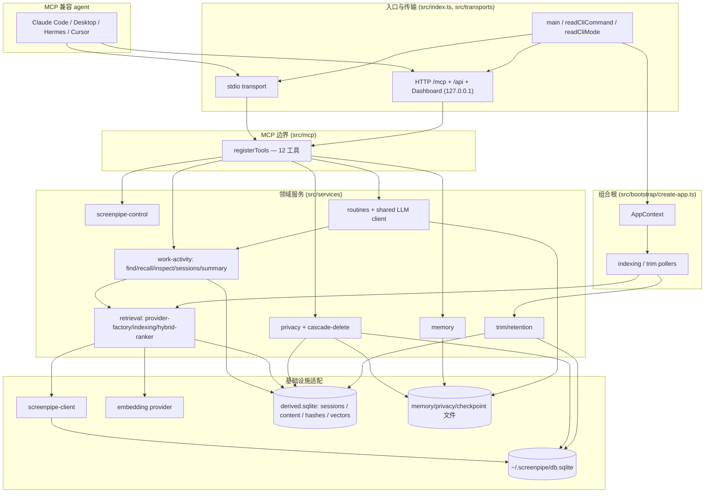

# computer-history-mcp 架构文档

## 1. 概览与核心价值

`computer-history-mcp`（包名 `computer-history-mcp`）是一个**本地优先的独立 MCP server**。它把 Screenpipe 的屏幕记忆能力——逐帧 accessibility（AX）/OCR 捕获、工作活动会话、长期记忆、文件分析、隐私控制——封装成一组标准 MCP 工具，供任意 MCP 兼容 agent（Claude Code、Claude Desktop、Hermes、Cursor、OpenClaw 等）直接调用。

核心约束决定了它的形态：

- **工具面与运维面分离**：agent 能力只通过 MCP tools 暴露；内置 Dashboard 是本地运维与配置面板，不提供对话界面。
- **本地优先 / 仅监听 127.0.0.1**：HTTP 服务在 managed 模式下被硬性限制只能绑定 `127.0.0.1`（见 `src/bootstrap/create-app.ts` 的绑定守卫）。数据存储与服务均在本机，满足隐私要求。
- **双接入形态**：同一套工具同时通过本地 stdio 与 Streamable HTTP 的 `/mcp` 路由暴露。
- **provider 配置化**：切换 embedding 供应商应当只改配置、不改代码。

运行时基于 **Node.js 22 LTS + TypeScript 5.x**，使用官方 MCP SDK 的 alpha 2.x 体系（`@modelcontextprotocol/server` / `@modelcontextprotocol/node` / `@modelcontextprotocol/client`）。`zod` 4.x 负责 schema 校验，`yaml` 负责配置解析与保留式写回，`@cfworker/json-schema` 负责工具 I/O 的 JSON-schema 校验，`node-cron` 负责 routines 调度。服务端使用内置 `node:http` 与 `node:sqlite`，没有 Web 服务框架或外部向量数据库；准确依赖版本以 `package.json` 为准。

**默认端口的两层语义**（避免误解）：代码 schema 默认端口为 **8765**（`src/config/schema.ts:11` `port: z.number().int().positive().default(8765)`，`appConfigSchema` 中 `server` 默认值同样为 `port: 8765`）。`load-config.ts` 在无 override / 无 env 时回退到 `parsed.data.server.port`（即 8765）。因此若不经 onboarding 直接 `npm run dev:http` 启动，会绑定 `127.0.0.1:8765`。而 **18765** 仅是 onboarding 流程写入 `config.yaml` 的值（`scripts/onboarding-config.js:23` `DEFAULT_SERVER_PORT = 18765`、`scripts/onboard.js:381`），`README.md` 因此以 `http://127.0.0.1:18765/mcp` 作为默认展示——它是 onboarding 默认，不是代码 schema/runtime 默认；`src/` 中从不出现 18765。

## 2. 分层架构

整个进程从 `src/index.ts` 的 `main()` 启动，按下列分层组织。每一层都映射到真实目录与文件。

### 2.1 Bootstrap 层（依赖注入组合根）

`src/bootstrap/create-app.ts` 的 `createApp(overrides)` 是唯一的组合根：调用 `loadConfig`、执行 managed-HTTP 的 127.0.0.1 绑定守卫、构建 logger，然后构造 providers、SQLite/文件存储、work-activity、隐私、诊断、共享 LLM client 与 routines 等领域服务，组装为单一 `AppContext`（用 `satisfies AppContext` 做编译期类型校验，运行时并未 `Object.freeze`，返回的是普通可变对象字面量）。传输层只接收 `app`，不重复装配领域服务。

此文件还定义了两个后台轮询器 `startIndexingPoller` 与 `startTrimPoller`（`setInterval` + `unref()` + 重入守卫）。

### 2.2 传输层（stdio / Streamable HTTP）

- `src/transports/stdio.ts`：`startStdioTransport(app)` 通过 `createMcpServer` 建 `McpServer`、`registerTools`，连接 `StdioServerTransport`。
- `src/transports/http.ts`：`startHttpTransport(app)` 用 `node:http` 建统一 HTTP 服务并绑定 `config.server.host:port`。`/mcp` 为带 Bearer 认证与连接数限制的无状态 Streamable HTTP 路由；`/api/*` 交给 Dashboard REST router；其余路径提供 Dashboard 静态资源与 SPA fallback。

### 2.3 MCP 边界层（工具注册 / 校验）

- `src/mcp/create-server.ts`：`createMcpServer()` 构造 `McpServer`（`name: 'computer-history-mcp'`、`version: getPackageVersion()`），**仅声明 `logging` capability**，并附带本机 screen memory 的使用边界说明。两种传输共享。
- `src/mcp/register-tools.ts`：`registerTools(server, app)` 按序注册 **12 个工具**。
- `src/mcp/tools/*`：每个工具一个文件，co-located zod 输入/输出 schema，handler 通过 `app.services` 拿到领域服务，返回统一的 `CallToolResult`（text content + structuredContent）。
- `src/mcp/tools/shared.ts`：共享响应格式化器与降级封装。

**重要事实**：MCP server 未注册任何 resources，所有能力都走 tools；resource 暴露是规划项、未实现。

### 2.4 领域服务层（`src/services/`）

- 屏幕采集（capture provider 边界）：`src/services/capture/`——`types.ts` 定义中立领域模型与端口（`CaptureRecord`、`CaptureClient`、`CaptureFrameDetailPort`、`CaptureLifecyclePort`、`CaptureCapabilities`、`buildCaptureId`/`parseCaptureId`），`provider-factory.ts` 按 `capture.provider` 配置装配 provider；Screenpipe 专属实现（HTTP client、frames reader、trim service、control service）全部收敛在 `src/services/capture/providers/screenpipe/`。上层服务只依赖中立端口，**禁止按 provider 名分支，必须按 capabilities 分支**；该边界由契约测试 `tests/contract/capture-boundary.test.ts` 守卫（白名单层：config、diagnostics、privacy、maintenance、screenpipe-control 工具）。
- 检索/索引：`src/services/retrieval/`（embedding provider 工厂、vector store、hybrid ranker、checkpoint、freshness policy、indexing service；capture client 经 provider factory 注入）。
- 工作活动：`src/services/work-activity/`（extraction 规则注册表、sessions 聚合、summary、embedding-service、find/recall/inspect、cascade-delete、observability、derived-database、hash-index）。
- 数据控制与可观测：`src/services/memory/`、`src/services/privacy/`、`src/services/file-analysis/`、`src/services/diagnostics/`、`src/services/runtime-process-registry.ts`、`src/services/bootstrap-status-service.ts`。
- Routines 调度引擎：`src/services/routines/`（`FileRoutineStore` + `RoutineScheduler` + `PromptDrivenExecutor`，由 `config.routines.enabled` 门控）。v2.7.0 起执行器为 prompt-driven LLM 执行（`FindService`+`RecallService` 并行检索 → 去重/截断/脱敏 → `LlmClient` 调用），无 LLM 配置时降级为确定性模板。共享 `LlmClient` 模块位于 `src/services/llm/llm-client.ts`。

### 2.5 基础设施适配层

- Screenpipe HTTP 适配：`src/services/capture/providers/screenpipe/http-client.ts`（`/search` 双查询 accessibility + ocr）。
- Embedding provider 工厂：`src/services/retrieval/provider-factory.ts`（统一走 OpenAI-compatible client + 并发限制装饰器）。
- 向量持久化：默认使用 `src/services/retrieval/sqlite-vector-store.ts` 的 **`SqliteVectorStore`**。向量以 Float32 BLOB 存入 `derived.sqlite` 的 `vectors` 表；查询先用 covering index 过滤时间/应用候选，再分批读取 BLOB 并在 JS 中做 dot-product 排序。`vectorStore.kind: file` 仅保留为显式 legacy 兼容模式。
- Derived SQLite：`src/services/work-activity/derived-database.ts`（`node:sqlite` 的 `DatabaseSync`，承载 `sessions`、`extracted_content`、`embedding_hash_index`、`vectors`）。首次升级会把既有 `vector-store.json` 一次性迁移到 `vectors` 表并保留 `.migrated` 备份。
- 文件持久化：记忆 / 隐私状态 / checkpoint / 日志 / runtime marker 全部用「写 `.tmp` 再 rename」的原子写。
- 日志：`src/lib/logging.ts`（带大小轮转的结构化 logger）；版本：`src/lib/version.ts`（`getPackageVersion()` 单一真相源）。

### 2.6 后台处理

- 索引轮询：`startIndexingPoller` → `DefaultIndexingService.runOnce()`。
- Trim/retention 轮询：`startTrimPoller` → `src/services/capture/providers/screenpipe/trim-service.ts`（仅当 provider 的 `capabilities.retentionTrim` 为 true 时调度，上游 db 路径经 `CaptureProvider.upstreamDatabasePath` 注入）。
- Routines 调度：`config.routines.enabled` 为 true 时，组合根构造 `RoutineScheduler` 并调用 `start()` 加载 enabled definitions；`routine-create` 写入后调用 `refresh()` 热更新 cron jobs。
- CLI safe-record 维护：`scripts/screenpipe-safe-record.js` 从 `screenpipe.binaryPath` 启动 `record`，将 `screenpipe.dataDirectory` 同时注入 `--data-dir` 和维护子进程，避免 recorder 与 SQLite 消费者指向不同数据集。维护默认每 10 分钟执行一次，并在 recorder 退出后执行一次 final pass；结果写入 `~/.computer-history-mcp/logs/screenpipe-maintenance.jsonl`，保留 7 天且超过 1 MB 时轮转到 `.1`。
- 会话聚合 / 摘要 / cascade-delete：均在 work-activity 子系统内，由索引循环与工具调用驱动。

## 3. 运行模式与传输

启动入口 `src/index.ts` 的 `main()` 解析 `process.argv`：

- `readCliCommand` 决定 `serve`（默认）还是 `rebuild-index`。
- `readCliMode` 解析 **值参数** `--mode stdio` / `--mode http`。**不存在 `--stdio` 布尔标志**；缺省时按 config 的 `server.mode`（默认 http）走。

`serve` 路径下，`createApp` 完成组合根装配后，`main` 安装运行时守卫与信号处理器（SIGINT→130、SIGTERM→143、exit，均幂等调用 `runtimeGuard.releaseSync()`），调用 `ensureRebuildLockNotHeld`、`registerRuntimeProcess`、`startIndexingPoller`，再按 `config.server.mode` 分派到 `startHttpTransport` 或 `startStdioTransport`。

**Managed 服务与绑定守卫**：当 `CANARY_ALPHA_MCP_MANAGED_SERVICE === '1'` 时，`create-app.ts` 的守卫强制 host 必须为 `127.0.0.1`，否则启动失败；logger 同时改为写文件并静默 stderr。launchd 集成解析 `~/Library/LaunchAgents/com.computer-history-mcp.plist`。

**rebuild-index 离线恢复路径**：与传输层独立。它先 `acquireRebuildLock` 取文件锁，再 `ensureRecoveryTargetIsOffline`——通过 `@modelcontextprotocol/client` 探测 `http://host:port/mcp` 并调用 `internal-status`，同时用 `ps` 扫描 legacy 进程，确认没有 live/managed/legacy server 仍持有检索 artifacts；随后直接清空 SQLite `vectors` 表与 checkpoint，重放全量 backlog，并输出包含 reset 目标、checkpoint 前后状态和 recovery status 的 JSON 报告。

**并发安全**：`src/services/runtime-process-registry.ts` 用每进程 `<pid>.json` marker（`process.kill(pid,0)` + `ps lstart=/etime=` 身份校验）做跨进程注册，并用 hardlink 的 `rebuild-index.lock` 保证 rebuild 单持有者，防止并发 writer 损坏 SQLite 与 checkpoint 状态。

## 4. MCP 工具面

`src/mcp/register-tools.ts` 当前注册 **12 个工具**。`src/mcp/tool-manifest.ts` 列出其中 11 个，仍未包含 `screenpipe-control`；这是为该工具保留的已知 manifest 例外，并由 tool-registry acceptance test 显式覆盖。

| 工具 | 用途 | 背后服务 |
|------|------|----------|
| `find` | 按 keyword / semantic / hybrid 检索工作活动证据片段 | `app.services.workActivity.find`（`find-service.ts`） |
| `recall` | 按时间窗回顾 sessions 或聚合时间块，可选摘要 | `app.services.workActivity.recall`（`recall-service.ts`） |
| `inspect` | 钻取单个 session 或单帧，返回证据行 / 原始 AX 树 | `app.services.workActivity.inspect`（`inspect-service.ts`） |
| `memory-read` | 读取长期记忆（scope: memory / user / all） | `app.services.memory`（`memory-service.ts`） |
| `memory-write` | 写入/追加长期记忆（append / replace） | `app.services.memory` |
| `file-analyze` | 摘要或问答本地文件 | `app.services.fileAnalysis` |
| `privacy-control` | status / pause / resume / exclude-app / delete-range | `app.services.privacy`（`privacy-control-service.ts`） |
| `screenpipe-control` | status / start / stop 托管 Screenpipe 子进程 | `app.services.screenpipeControl` |
| `internal-status` | 运行时健康与检索/恢复状态聚合 | `app.services.bootstrapStatus`（`bootstrap-status-service.ts`） |
| `routine-list` | 列出 routine 定义及最近运行状态 | `app.services.routines.store` |
| `routine-create` | 创建或更新 prompt-driven routine 并刷新调度器 | `app.services.routines.store` / `scheduler` |
| `routine-history` | 读取 routine 执行历史 | `app.services.routines.store` |

说明：

- legacy `search-screen` / `recent-activity` 已在 task 8.1 移除，`find` / `recall` / `inspect` 是其前向替代。
- routines 工具由 v2.4.0 交付；v2.7.0 已把执行层升级为 prompt-driven LLM 汇总（见 [routines-v2-llm-execution.md](./specs/routines-v2-llm-execution.md)）。
- 大多数工具返回「双通道」结果（text content + 符合 outputSchema 的 structuredContent）；`screenpipe-control` 是唯一只返回 text、无 structuredContent 的工具。
- find/recall/inspect 共享统一降级信封：失败时返回 `isError: true` 且 structuredContent 仍 schema-valid，`narrativeText` 携带中文诊断「派生数据当前不可访问」。

## 5. 核心数据流

### (a) 检索路径（find）

1. **semantic 模式**：embedder（`provider-factory.ts`）对 query 产出向量 → `SqliteVectorStore.query` 用 covering index 过滤候选并对匹配窗口内的向量做 dot-product 排序 → 命中的 `extracted:N` id 反解回同一 derived SQLite 的 `extracted_content` 行。
2. **keyword 模式**：直接 keyset 分页扫描 **derived SQLite 的 `extracted_content` 表**（JS 侧 NFC/locale 关键词匹配），**不是 Screenpipe keyword API**。
3. **hybrid 模式**：RRF 融合函数 `fuseHybridResults`（`src/services/retrieval/hybrid-ranker.ts`，k=60）已实现，但**尚未接入 live find 流程**——当前 `mode=hybrid` 等价于 `mode=semantic`（R7.7 deferred），查询时不发生 keyword+semantic 融合。

### (b) 索引路径

1. `startIndexingPoller` 周期触发 `DefaultIndexingService.runOnce()`：读 checkpoint、flush 空闲 session。首次启动时执行 priority catch-up（最多 10 轮连续 `runOnce`）快速清理积压。
2. `fetchCandidateRecords` 在稳态用 `screenpipe-client.recent(windowMinutes)`、在 backlog 追赶时分页 `search()`。Screenpipe client 对 `/search` 双查询（accessibility 主 + ocr 兜底），`mergeByFrameId`（AX 优先）合并。
3. 过滤晚于 checkpoint 的记录 → 剪除 secure-AX 子树。
4. **Step 1（串行）**：逐帧 `extraction 规则注册表`（`TerminalRefinementRule → UniversalStructuredExtractor`）产出**每帧一个 `ExtractionResult`**（**无 chunker、无 audio/转录**）；索引器优先使用捕获 provider 的完整 frame-detail AX 树（包括 sweep 将 JSON 转入 `elements` 后通过 `elements_ref_frame_id` 重建的树），缺失时才使用兼容性文本兜底，并在进入任一提取规则前按 `privacy.secureAxRoles` 递归裁剪安全字段子树。随后经过 `LineDeltaDeduplicator` 会话级行级差量去重（静态导航/标题仅首次写入，相同帧 0 字节输出，空闲超时自动重置；重启时从仍开放 session 的 `started_at` 读取至持久化 checkpoint（含 checkpoint 行），同时间戳按持久化的 `capture_cursor` 排序，待重试行不参与恢复；仅在成功 checkpoint 后提交本轮预览），同时写 derived SQLite（`extracted_content`）并折叠到 `SessionAggregator`。隐私状态逐帧刷新，被阻断的记录进入 blocked 队列。
5. **Step 2（并发）**：通过 `computeEmbedding()` 发起并发 embedding 调用（滑动窗口 promise 池，并发度由 `providers.embeddings.concurrency` 控制，默认 `DEFAULT_EMBEDDING_CONCURRENCY=2`），仅计算 embedding 向量，不写 vector store。按 SHA256 在 `embedding_hash_index` 去重（命中复用向量）。
6. **Step 3（串行）**：将所有成功的 embedding 批量写入当前 vector store；默认落入 `derived.sqlite` 的 `vectors` 表（id=`extracted:${frameId}`，单次 `upsert` 调用）。
7. 推进 checkpoint（provider-unavailable 时回退保持，extraction/session 行仍持久化，embedding 稍后重试）。blocked 记录释放后走串行 `embedExtraction` 路径。

### (c) work-activity 端到端

raw Screenpipe AX 帧 → `extraction` 规则注册表（`UniversalStructuredExtractor` 进行四大语义域 `[Window]`/`[Nav]`/`[Action]`/`[Body]` 结构化提取与会话导航富化）→ `LineDeltaDeduplicator` 行级差量去重 → `SessionAggregator.handleExtraction` 按 `(appName, contextKey)` 在 idle 阈值内扩展或开新 session（追加 `evidence_frame_ids`、累加 clamp 后的 `active_seconds`）→ 两路消费：`EmbeddingService` 做去重+向量化、`SummaryWorker` 按需生成摘要 → 读侧 `recall` / `find` / `inspect` 工具消费。

### (d) memory 读写

`DefaultMemoryService`（`memory-service.ts`）覆盖 `FileMemoryStore`：每个 scope（memory / user）一个 UTF-8 文件，原子 temp+rename 写。read 总是加载两 scope；`scope=all` 合并渲染；write 支持 replace 覆盖或 append 空行拼接。

### (e) privacy 控制与 cascade-delete tombstone

`DefaultPrivacyControlService.execute()` 分派 status/pause/resume/exclude-app/delete-range。`delete-range` 必须 `confirm=true`，用 `node:sqlite` 打开 Screenpipe `db.sqlite`，按 `DELETE_BATCH_SIZE=200` 参数绑定批删 frames+elements，再用 `CascadeDeleteCoordinator` 按精确 frame ids 级联清除 derived 的 sessions/extracted_content/embeddings（**但从不删内容寻址的 hash 缓存**）。级联失败时写入 `cascade-failure` suppressed-range tombstone，作为 find/recall 的检索排除门；`reconcileCascadeFailures` 重放未决 tombstone 并打 `resolvedAt`。pause 记录 `pauseStartedAt`，resume 追加 `pause` suppressed-range。

### (f) trim/retention 保留策略

`startTrimPoller` → `runTrimOnce()`（去重帧 + 清空 `accessibility_tree_json`）→ `runRetentionIfOverBudget()`：当 `db.sqlite` 超过 `diskBudgetBytes` 且存在早于保留下限的行时，循环 `deleteOldestBatch()`（`BEGIN IMMEDIATE` 事务 + `DELETE ... RETURNING id` 取精确删除集，分块 500），对每批删除做 cascade，失败则向注入的 `privacyStore` 写 tombstone。全程优雅降级，返回部分计数。

## 6. 配置与 provider 抽象

### 6.1 配置加载与优先级

`src/config/load-config.ts` 的 `loadConfig(overrides?)` 是唯一加载入口：读取 `~/.computer-history-mcp/config.yaml`（`YAML.parse`，文件缺失即 ENOENT 时回退空对象），再用 `appConfigSchema.safeParse` 校验，校验失败抛出带文件路径的明确错误。生效优先级（高→低）：

1. **代码 overrides**（`createApp` 传入的 `mode` / `port` / `logLevel` / `vectorStorePath`，主要供 CLI 与测试）
2. **环境变量**：`MCP_MODE`、`MCP_PORT`（经 `parseOptionalPort` 校验）、`CANARY_ALPHA_MCP_MANAGED_SERVICE`
3. **`config.yaml` 文件值**
4. **zod schema 默认值**

### 6.2 zod schema 结构（`src/config/schema.ts`）

`appConfigSchema` 聚合：`server`（mode / host / port / auth token / connection limit）、`logging`、`screenpipe`、`providers.embeddings`、`vectorStore`、`retrieval`、`routines`、`trim`、`capture`、`storage`、`privacy` 与 `analysis`。字段、默认值和环境变量覆盖的权威说明见 [配置参考](./reference/configuration.md)；本节只描述模块边界，避免复制完整 schema。

### 6.3 embedding provider 抽象（切换不改代码）

`embeddingsProviderSchema`：`kind`（默认 `openai-compatible`）、`baseUrl`、`model`、`apiKey`、`concurrency`（默认 `DEFAULT_EMBEDDING_CONCURRENCY=2`）。`src/services/retrieval/provider-factory.ts` 统一构造 OpenAI-compatible client 并套并发限制装饰器，因此切换 dashscope / openai / ollama / azure **只需改 `config.yaml` 的 `providers.embeddings`，无需改业务代码**。

### 6.4 capture provider 抽象（接入新采集工具只加目录 + 一行配置）

`capture.provider`（枚举，默认 `screenpipe`）选择采集 provider，`src/services/capture/provider-factory.ts` 的 `createCaptureProvider(config)` 负责装配：返回 `CaptureProvider`（capabilities + client + 可选 frameDetail / lifecycle / upstreamDatabasePath）。`screenpipe:` 顶层配置段从此定义为 screenpipe provider 的专属配置块。持久化关联键使用中立 `captureId`（`<provider>:frame:<id>`），过渡期与遗留裸 `frameId` 双写、删除路径双键匹配；检索 checkpoint 按 provider 命名空间隔离（`retrieval-checkpoint.<provider>.json`，升级时无损接管旧文件）；对外错误码中立化为 `CAPTURE_SOURCE_UNAVAILABLE`（error 对象保留 `screenpipeCode` 兼容属性）。`internal-status` 输出 `captureProvider.provider` 与 capabilities。

> **兼容性说明**：`vectorStore.kind: file` 显式启用 legacy `FileBackedVectorStore`；其他值均使用 `SqliteVectorStore`。字段级默认值是 `sqlite`，顶层缺省对象仍接受历史 `chroma` 值并由 factory 解释为 SQLite，以兼容既有配置。

### 6.5 数据与存储目录布局

| 路径 | 内容 |
|------|------|
| `~/.computer-history-mcp/config.yaml` | 用户配置（`CONFIG_PATH_SEGMENT`） |
| `~/.computer-history-mcp/derived.sqlite` | derived DB：`sessions` / `extracted_content` / `embedding_hash_index` / `vectors`（可经 `paths.derivedDatabase` 覆盖） |
| `~/.computer-history-mcp/vector-store.json.migrated` | 从 legacy JSON vector store 首次迁移到 SQLite 后保留的备份；新安装不会创建 |
| `~/.computer-history-mcp/retrieval-checkpoint.<provider>.json` | 索引 checkpoint（按 capture provider 命名空间，如 `retrieval-checkpoint.screenpipe.json`；旧的 `retrieval-checkpoint.json` 升级时被一次性接管） |
| `~/.computer-history-mcp/privacy-state.json` | 隐私状态 / suppressed-range tombstone |
| `~/.computer-history-mcp/memory/{memory,user}.md` | 长期记忆（每 scope 一文件） |
| `~/.computer-history-mcp/logs/service.log` | 结构化日志（大小轮转） |
| `~/.computer-history-mcp/logs/screenpipe-maintenance.jsonl` | safe-record 维护任务 JSONL 日志（7 天保留，1 MB 轮转） |
| `~/.computer-history-mcp/routines/{definitions,history}/` | Routine 定义与执行历史 |
| `~/.computer-history-mcp/runtime-processes/<pid>.json` + `rebuild-index.lock` | 跨进程注册与 rebuild 单持有者锁 |
| `~/.screenpipe/db.sqlite` | **Screenpipe 源数据库**（只读检索 + 受 privacy/trim 删除） |

## 7. 已规划但未实现

以下能力尚未交付；准确状态与验收范围以 [spec 索引](./specs/README.md) 和 [远期需求池](./specs/future-backlog.md) 为准：

- **Routine 删除**：已形成 active spec，尚无 MCP tool、Dashboard 删除入口或 REST delete endpoint。
- **Routine 手动触发、MCP resources 与跨机器同步**：仅在远期需求池中记录。
- **Meeting / Calendar 集成**：`src/` 中不存在 calendar / meeting 实现。
- **通用 MCP resources 暴露**：当前 server 未注册 resources；业务能力仍通过 tools 暴露。

## 8. 关键设计决策与约束

以下项目约束由代码和契约测试共同兑现：

- **独立 MCP server 形态**：同时兼容本地 stdio 与 Streamable HTTP，两种传输共享同一套 `createMcpServer` + `registerTools`，无第二套实现。
- **本地优先 / 仅 127.0.0.1**：managed 模式下 host 被硬性守卫为 `127.0.0.1`，越界即启动失败；数据全部落本机用户目录。
- **无对话前端**：agent 能力只经 MCP tools 暴露；Dashboard 只承担本地运维和配置，不提供聊天能力。
- **provider 配置化**：embedding 供应商切换只改 `config.yaml`，业务链路不依赖具体 SDK 分支（OpenAI-compatible 抽象 + 并发限制装饰器）。
- **单 writer 持久化**：默认向量、sessions、extracted content 与 hash index 共享 derived SQLite，并假定单写入者；`runtime-process-registry` 的 per-pid marker 与 `rebuild-index.lock` hardlink 锁用于阻止并发 writer 与离线重建冲突。
- **依赖注入便于测试**：`createApp` 是唯一组合根，所有路径、时钟、provider、store 均可注入覆盖，传输层从不自行构造服务，使单元/契约/故障注入测试可替换任意边界。
- **优雅降级**：检索/索引/trim 在 Screenpipe 或 embedding endpoint 不可用时返回部分结果或 schema-valid 的降级信封，而非整体崩溃。

## 9. 组件关系图

