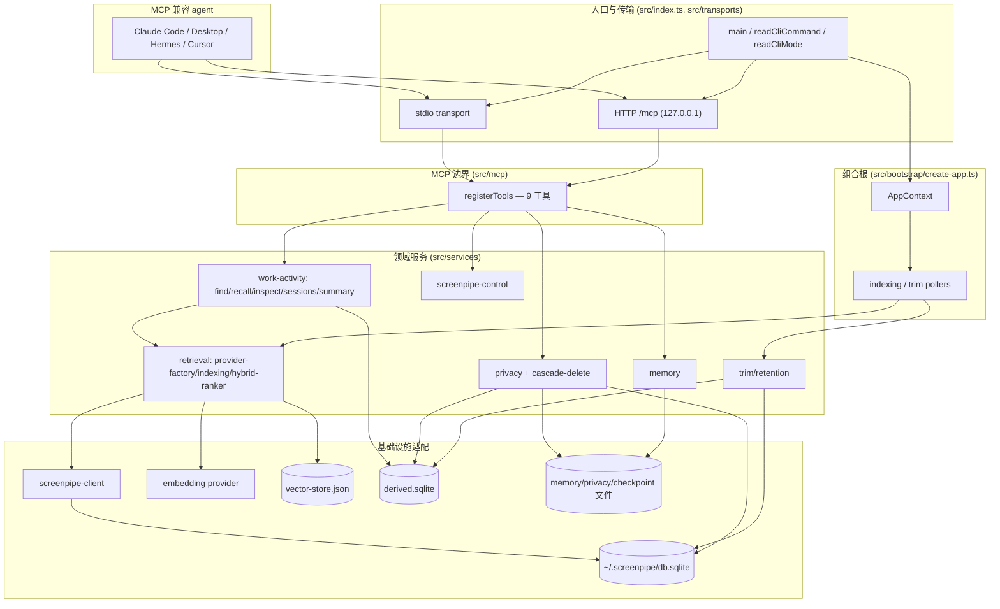

# canary-alpha-mcp 架构文档

## 1. 概览与核心价值

`canary-alpha-mcp`（包名 `canary-alpha-mcp`）是一个**本地优先的独立 MCP server**。它把 Screenpipe 的屏幕记忆能力——逐帧 accessibility（AX）/OCR 捕获、工作活动会话、长期记忆、文件分析、隐私控制——封装成一组标准 MCP 工具，供任意 MCP 兼容 agent（Claude Code、Claude Desktop、Hermes、Cursor、OpenClaw 等）直接调用。

核心约束决定了它的形态：

- **无前端**：所有能力只通过 MCP tools 暴露，项目不提供任何 UI。
- **本地优先 / 仅监听 127.0.0.1**：HTTP 服务在 managed 模式下被硬性限制只能绑定 `127.0.0.1`（见 `src/bootstrap/create-app.ts` 的绑定守卫）。数据存储与服务均在本机，满足隐私要求。
- **双接入形态**：同一套工具同时通过本地 stdio 与 Streamable HTTP（单一 `/mcp` 路由）暴露。
- **provider 配置化**：切换 embedding 供应商应当只改配置、不改代码。

运行时基于 **Node.js 22 LTS + TypeScript 5.x**，使用官方 MCP SDK 的 alpha 2.x 体系（`@modelcontextprotocol/server` / `@modelcontextprotocol/node` / `@modelcontextprotocol/client`），schema 校验使用 `zod` 4.x，配置文件解析使用 `yaml`，并带一个轻量 JSON-schema 校验器 `@cfworker/json-schema`（^4.1.1，用于工具 I/O 的 JSON-schema 校验链路）。运行时依赖刻意保持极小（见 `package.json`：仅 `@cfworker/json-schema`、`@modelcontextprotocol/{server,node,client}`、`yaml`、`zod`；没有 web 框架、没有 chromadb、没有 node-cron）。

**默认端口的两层语义**（避免误解）：代码 schema 默认端口为 **8765**（`src/config/schema.ts:11` `port: z.number().int().positive().default(8765)`，`appConfigSchema` 中 `server` 默认值同样为 `port: 8765`）。`load-config.ts` 在无 override / 无 env 时回退到 `parsed.data.server.port`（即 8765）。因此若不经 onboarding 直接 `npm run dev:http` 启动，会绑定 `127.0.0.1:8765`。而 **18765** 仅是 onboarding 流程写入 `config.yaml` 的值（`scripts/onboarding-config.js:23` `DEFAULT_SERVER_PORT = 18765`、`scripts/onboard.js:381`），`README.md` 因此以 `http://127.0.0.1:18765/mcp` 作为默认展示——它是 onboarding 默认，不是代码 schema/runtime 默认；`src/` 中从不出现 18765。

## 2. 分层架构

整个进程从 `src/index.ts` 的 `main()` 启动，按下列分层组织。每一层都映射到真实目录与文件。

### 2.1 Bootstrap 层（依赖注入组合根）

`src/bootstrap/create-app.ts` 的 `createApp(overrides)` 是唯一的组合根：调用 `loadConfig`、执行 managed-HTTP 的 127.0.0.1 绑定守卫、构建 logger，然后一次性构造所有服务（embedding provider、screenpipe client、vector store、checkpoint store、文件/记忆/隐私服务、derived SQLite 数据库及其 Sqlite 存储、会话聚合器、embedding service、cascade-delete coordinator、find/inspect/recall 服务、observability、indexing service），组装为单一 `AppContext`（用 `satisfies AppContext` 做编译期类型校验，运行时并未 `Object.freeze`，返回的是普通可变对象字面量）。传输层只接收 `app`，从不自行构造服务。

此文件还定义了两个后台轮询器 `startIndexingPoller` 与 `startTrimPoller`（`setInterval` + `unref()` + 重入守卫）。

### 2.2 传输层（stdio / Streamable HTTP）

- `src/transports/stdio.ts`：`startStdioTransport(app)` 通过 `createMcpServer` 建 `McpServer`、`registerTools`，连接 `StdioServerTransport`。
- `src/transports/http.ts`：`startHttpTransport(app)` 用 `node:http` 建服务器，非 `/mcp` 路径一律 404；对 `/mcp` **每个请求**新建一套 `NodeStreamableHTTPServerTransport`（`sessionIdGenerator: undefined` → 无状态）+ `McpServer` + `registerTools`，再 `transport.handleRequest`。绑定 `config.server.host:port`。

### 2.3 MCP 边界层（工具注册 / 校验）

- `src/mcp/create-server.ts`：`createMcpServer()` 构造 `McpServer`（`name: 'canary-alpha-mcp'`、`version: getPackageVersion()`），**仅声明 `logging` capability**，附带 Crimson instructions。两种传输共享。
- `src/mcp/register-tools.ts`：`registerTools(server, app)` 按序注册 **9 个工具**。
- `src/mcp/tools/*`：每个工具一个文件，co-located zod 输入/输出 schema，handler 通过 `app.services` 拿到领域服务，返回统一的 `CallToolResult`（text content + structuredContent）。
- `src/mcp/tools/shared.ts`：共享响应格式化器与降级封装。

**重要事实**：MCP server 未注册任何 resources，所有能力都走 tools；resource 暴露是规划项、未实现。

### 2.4 领域服务层（`src/services/`）

- 检索/索引：`src/services/retrieval/`（screenpipe client、embedding provider 工厂、vector store、hybrid ranker、checkpoint、freshness policy、indexing service）。
- 工作活动：`src/services/work-activity/`（extraction 规则注册表、sessions 聚合、summary、embedding-service、find/recall/inspect、cascade-delete、observability、derived-database、hash-index）。
- 数据控制与可观测：`src/services/memory/`、`src/services/privacy/`、`src/services/file-analysis/`、`src/services/screenpipe-control/`、`src/services/trim/`、`src/services/diagnostics/`、`src/services/runtime-process-registry.ts`、`src/services/bootstrap-status-service.ts`。
- 已定义但未接线：`src/services/routines/`（见第 7 节）。

### 2.5 基础设施适配层

- Screenpipe HTTP 适配：`src/services/retrieval/screenpipe-client.ts`（`/search` 双查询 accessibility + ocr）。
- Embedding provider 工厂：`src/services/retrieval/provider-factory.ts`（统一走 OpenAI-compatible client + 并发限制装饰器）。
- 向量持久化：`src/services/retrieval/vector-store.ts` 的 **`FileBackedVectorStore`**，持久化到 `vector-store.json`，内存内 dot-product 暴力检索。**不是 Chroma**——`createVectorStore` 始终返回它并忽略 `config.vectorStore.kind`。
- Derived SQLite：`src/services/work-activity/derived-database.ts`（`node:sqlite` 的 `DatabaseSync`，承载 `sessions`、`extracted_content`、`embedding_hash_index`）。
- 文件持久化：记忆 / 隐私状态 / checkpoint / 日志 / runtime marker 全部用「写 `.tmp` 再 rename」的原子写。
- 日志：`src/lib/logging.ts`（带大小轮转的结构化 logger）；版本：`src/lib/version.ts`（`getPackageVersion()` 单一真相源）。

### 2.6 后台处理

- 索引轮询：`startIndexingPoller` → `DefaultIndexingService.runOnce()`。
- Trim/retention 轮询：`startTrimPoller` → `src/services/trim/screenpipe-trim-service.ts`。
- CLI safe-record 维护：`scripts/screenpipe-safe-record.js` 在 `screenpipe@latest record` 旁路启动 `scripts/screenpipe-db-maintain.ts run`，默认每 10 分钟执行一次，并在 recorder 退出后执行一次 final pass。维护运行结果写入 `~/.canary-alpha-mcp/logs/screenpipe-maintenance.jsonl`，该 JSONL 日志保留 7 天且超过 1 MB 时轮转到 `.1`。周期性维护不阻塞 recorder 生命周期；final pass 会等待维护日志落盘后再结束 wrapper。
- 会话聚合 / 摘要 / cascade-delete：均在 work-activity 子系统内，由索引循环与工具调用驱动。

## 3. 运行模式与传输

启动入口 `src/index.ts` 的 `main()` 解析 `process.argv`：

- `readCliCommand` 决定 `serve`（默认）还是 `rebuild-index`。
- `readCliMode` 解析 **值参数** `--mode stdio` / `--mode http`。**不存在 `--stdio` 布尔标志**；缺省时按 config 的 `server.mode`（默认 http）走。

`serve` 路径下，`createApp` 完成组合根装配后，`main` 安装运行时守卫与信号处理器（SIGINT→130、SIGTERM→143、exit，均幂等调用 `runtimeGuard.releaseSync()`），调用 `ensureRebuildLockNotHeld`、`registerRuntimeProcess`、`startIndexingPoller`，再按 `config.server.mode` 分派到 `startHttpTransport` 或 `startStdioTransport`。

**Managed 服务与绑定守卫**：当 `CANARY_ALPHA_MCP_MANAGED_SERVICE === '1'` 时，`create-app.ts` 的守卫强制 host 必须为 `127.0.0.1`，否则启动失败；logger 同时改为写文件并静默 stderr。launchd 集成解析 `~/Library/LaunchAgents/com.canary-alpha-mcp.plist`。

**rebuild-index 离线恢复路径**：与传输层独立。它先 `acquireRebuildLock` 取文件锁，再 `ensureRecoveryTargetIsOffline`——通过 `@modelcontextprotocol/client` 探测 `http://host:port/mcp` 并调用 `internal-status`（匹配 `status==ok && mode==http && configFile`），同时用 `ps` 扫描 legacy 进程，确认没有 live/managed/legacy server 仍持有检索 artifacts；随后用临时 `vectorStorePath` 重放全量 backlog，最后把重建的 `vector-store.json` / `retrieval-checkpoint.json` 原子换入（带 `.bak` 回滚），打印 JSON 恢复报告。

**并发安全**：`src/services/runtime-process-registry.ts` 用每进程 `<pid>.json` marker（`process.kill(pid,0)` + `ps lstart=/etime=` 身份校验）做跨进程注册，并用 hardlink 的 `rebuild-index.lock` 保证 rebuild 单持有者，防止并发 writer 损坏检索状态（单 writer 风险是 FileBackedVectorStore / SQLite 的关键约束）。

## 4. MCP 工具面

v1 在 `src/mcp/register-tools.ts` 中实际注册 **9 个工具**。`src/mcp/tool-manifest.ts` 只列了 8 个（遗漏 `screenpipe-control`，属已知 manifest/registry 偏差；README 也按 8 个列出）。

| 工具 | 用途 | 背后服务 |
|------|------|----------|
| `find` | 按 keyword / semantic / hybrid 检索工作活动证据片段 | `app.services.workActivity.find`（`find-service.ts`） |
| `recall` | 按时间窗回顾 sessions 或聚合时间块，可选摘要 | `app.services.workActivity.recall`（`recall-service.ts`） |
| `inspect` | 钻取单个 session 或单帧，返回证据行 / 原始 AX 树 | `app.services.workActivity.inspect`（`inspect-service.ts`） |
| `memory-read` | 读取长期记忆（scope: memory / user / all） | `app.services.memory`（`memory-service.ts`） |
| `memory-write` | 写入/追加长期记忆（append / replace） | `app.services.memory` |
| `file-analyze` | 摘要或问答本地文件 | `app.services.fileAnalysis` |
| `privacy-control` | status / pause / resume / exclude-app / delete-range | `app.services.privacy`（`privacy-control-service.ts`） |
| `screenpipe-control` | status / start / stop 托管 Screenpipe 子进程 | `app.services.screenpipeControl` |
| `internal-status` | 运行时健康与检索/恢复状态聚合 | `app.services.bootstrapStatus`（`bootstrap-status-service.ts`） |

说明：

- legacy `search-screen` / `recent-activity` 已在 task 8.1 移除，`find` / `recall` / `inspect` 是其前向替代。
- **routines 未作为 MCP 工具暴露**（见第 7 节）。
- 大多数工具返回「双通道」结果（text content + 符合 outputSchema 的 structuredContent）；`screenpipe-control` 是唯一只返回 text、无 structuredContent 的工具。
- find/recall/inspect 共享统一降级信封：失败时返回 `isError: true` 且 structuredContent 仍 schema-valid，`narrativeText` 携带中文诊断「派生数据当前不可访问」。

## 5. 核心数据流

### (a) 检索路径（find）

1. **semantic 模式**：embedder（`provider-factory.ts`）对 query 产出向量 → `FileBackedVectorStore.query` 用 dot-product 在 `vector-store.json` 内打分排序 → 命中的 `extracted:N` id 反解回 derived SQLite 的 `extracted_content` 行。
2. **keyword 模式**：直接 keyset 分页扫描 **derived SQLite 的 `extracted_content` 表**（JS 侧 NFC/locale 关键词匹配），**不是 Screenpipe keyword API**。
3. **hybrid 模式**：RRF 融合函数 `fuseHybridResults`（`src/services/retrieval/hybrid-ranker.ts`，k=60）已实现，但**尚未接入 live find 流程**——当前 `mode=hybrid` 等价于 `mode=semantic`（R7.7 deferred），查询时不发生 keyword+semantic 融合。

### (b) 索引路径

1. `startIndexingPoller` 周期触发 `DefaultIndexingService.runOnce()`：读 checkpoint、flush 空闲 session。
2. `fetchCandidateRecords` 在稳态用 `screenpipe-client.recent(windowMinutes)`、在 backlog 追赶时分页 `search()`。Screenpipe client 对 `/search` 双查询（accessibility 主 + ocr 兜底），`mergeByFrameId`（AX 优先）合并。
3. 过滤晚于 checkpoint 的记录 → 剪除 secure-AX 子树 → 隐私过滤。
4. 逐帧 `extraction 规则注册表`（`TerminalRefinementRule → GenericHeuristicRule`）产出**每帧一个 `ExtractionResult`**（**无 chunker、无 audio/转录**）。
5. 逐条 embed：`embed(input: string)` 单条处理，`embedExtraction` 每次一个 extraction，仅受并发限制器约束（默认 `DEFAULT_EMBEDDING_CONCURRENCY=2`，**不批处理**）。
6. 写 derived SQLite（`extracted_content`）+ `vector-store.json`（id=`extracted:${frameId}`）+ 按 SHA256 在 `embedding_hash_index` 去重（命中复用向量、仍写每帧向量行）。
7. 推进 checkpoint（provider-unavailable 时回退保持，extraction/session 行仍持久化，embedding 稍后重试）。

### (c) work-activity 端到端

raw Screenpipe AX 帧 → `extraction` 规则注册表（每帧一个 ExtractionResult，含规范化 `contextKey`/`contextLabel`）→ `SessionAggregator.handleExtraction` 按 `(appName, contextKey)` 在 idle 阈值内扩展或开新 session（追加 `evidence_frame_ids`、累加 clamp 后的 `active_seconds`）→ 两路消费：`EmbeddingService` 做去重+向量化、`SummaryWorker` 按需生成摘要 → 读侧 `recall` / `find` / `inspect` 工具消费。

### (d) memory 读写

`DefaultMemoryService`（`memory-service.ts`）覆盖 `FileMemoryStore`：每个 scope（memory / user）一个 UTF-8 文件，原子 temp+rename 写。read 总是加载两 scope；`scope=all` 合并渲染；write 支持 replace 覆盖或 append 空行拼接。

### (e) privacy 控制与 cascade-delete tombstone

`DefaultPrivacyControlService.execute()` 分派 status/pause/resume/exclude-app/delete-range。`delete-range` 必须 `confirm=true`，用 `node:sqlite` 打开 Screenpipe `db.sqlite`，按 `DELETE_BATCH_SIZE=200` 参数绑定批删 frames+elements，再用 `CascadeDeleteCoordinator` 按精确 frame ids 级联清除 derived 的 sessions/extracted_content/embeddings（**但从不删内容寻址的 hash 缓存**）。级联失败时写入 `cascade-failure` suppressed-range tombstone，作为 find/recall 的检索排除门；`reconcileCascadeFailures` 重放未决 tombstone 并打 `resolvedAt`。pause 记录 `pauseStartedAt`，resume 追加 `pause` suppressed-range。

### (f) trim/retention 保留策略

`startTrimPoller` → `runTrimOnce()`（去重帧 + 清空 `accessibility_tree_json`）→ `runRetentionIfOverBudget()`：当 `db.sqlite` 超过 `diskBudgetBytes` 且存在早于保留下限的行时，循环 `deleteOldestBatch()`（`BEGIN IMMEDIATE` 事务 + `DELETE ... RETURNING id` 取精确删除集，分块 500），对每批删除做 cascade，失败则向注入的 `privacyStore` 写 tombstone。全程优雅降级，返回部分计数。

## 6. 配置与 provider 抽象

### 6.1 配置加载与优先级

`src/config/load-config.ts` 的 `loadConfig(overrides?)` 是唯一加载入口：读取 `~/.canary-alpha-mcp/config.yaml`（`YAML.parse`，文件缺失即 ENOENT 时回退空对象），再用 `appConfigSchema.safeParse` 校验，校验失败抛出带文件路径的明确错误。生效优先级（高→低）：

1. **代码 overrides**（`createApp` 传入的 `mode` / `port` / `logLevel` / `vectorStorePath`，主要供 CLI 与测试）
2. **环境变量**：`MCP_MODE`、`MCP_PORT`（经 `parseOptionalPort` 校验）、`CANARY_ALPHA_MCP_MANAGED_SERVICE`
3. **`config.yaml` 文件值**
4. **zod schema 默认值**

### 6.2 zod schema 结构（`src/config/schema.ts`）

`appConfigSchema` 聚合：`server`（`mode` 默认 `http`、`host` 默认 `127.0.0.1`、`port` 默认 `8765`）、`logging.level`（默认 `info`）、`screenpipe`（`url` / `apiKey` 可选）、`providers.embeddings`、`vectorStore`、`trim`（`enabled` 默认 true、`intervalSeconds` 默认 600）、`capture`、`storage`（`diskBudgetBytes` 默认 `null` 即不限、`retentionDays` 默认 7）、`privacy`（`excludeApps` 默认 `['1Password','Keychain Access']`、`secureAxRoles` 默认 `['AXSecureTextField']`）。

### 6.3 embedding provider 抽象（切换不改代码）

`embeddingsProviderSchema`：`kind`（默认 `openai-compatible`）、`baseUrl`、`model`、`apiKey`、`concurrency`（默认 `DEFAULT_EMBEDDING_CONCURRENCY=2`）。`src/services/retrieval/provider-factory.ts` 统一构造 OpenAI-compatible client 并套并发限制装饰器，因此切换 dashscope / openai / ollama / azure **只需改 `config.yaml` 的 `providers.embeddings`，无需改业务代码**。

> **装饰性配置警示**：`vectorStoreConfigSchema.kind` 默认值为 `'chroma'`，但 `createVectorStore` 完全忽略它、始终返回 `FileBackedVectorStore`。该字段当前无运行时效果，保留仅为向后兼容/未来扩展。

### 6.4 数据与存储目录布局

| 路径 | 内容 |
|------|------|
| `~/.canary-alpha-mcp/config.yaml` | 用户配置（`CONFIG_PATH_SEGMENT`） |
| `~/.canary-alpha-mcp/derived.sqlite` | derived DB：`sessions` / `extracted_content` / `embedding_hash_index`（可经 `paths.derivedDatabase` 覆盖） |
| `~/.canary-alpha-mcp/vector-store.json` | `FileBackedVectorStore` 持久化（可经 `vectorStore.path` 覆盖，支持 `~/` 展开） |
| `~/.canary-alpha-mcp/retrieval-checkpoint.json` | 索引 checkpoint |
| `~/.canary-alpha-mcp/privacy-state.json` | 隐私状态 / suppressed-range tombstone |
| `~/.canary-alpha-mcp/memory/{memory,user}.md` | 长期记忆（每 scope 一文件） |
| `~/.canary-alpha-mcp/logs/service.log` | 结构化日志（大小轮转） |
| `~/.canary-alpha-mcp/logs/screenpipe-maintenance.jsonl` | safe-record 维护任务 JSONL 日志（7 天保留，1 MB 轮转） |
| `~/.canary-alpha-mcp/routines/{definitions,history}/` | 已定义但**未接线**（见第 7 节） |
| `~/.canary-alpha-mcp/runtime-processes/<pid>.json` + `rebuild-index.lock` | 跨进程注册与 rebuild 单持有者锁 |
| `~/.screenpipe/db.sqlite` | **Screenpipe 源数据库**（只读检索 + 受 privacy/trim 删除） |

## 7. 已规划但未实现

以下能力在代码或配置中留有痕迹，但**当前 runtime 不存在**，文档读者不应据此假定其可用：

- **Routines / 调度引擎**：`src/services/routines/`（`FileRoutineStore` + types）已定义，`paths.ts` 也预留了 `routines/{definitions,history}` 目录，config 留有 routines 块（默认 disabled）。但 `FileRoutineStore` **从未在 `create-app.ts` 实例化或接线**，没有 cron 调度器、没有 executor、没有 `node-cron` 依赖，routines 也**未作为 MCP 工具暴露**。整条 routine 执行链路属后续 phase。
- **Meeting / Calendar 集成**：`src/` 中不存在任何 calendar / meeting 代码，纯属规划。
- **MCP resources 暴露**：当前 server 仅声明 `logging` capability，未注册任何 resources；resource 形态的能力暴露是规划项。

## 8. 关键设计决策与约束

源自 `CLAUDE.md` 的项目约束，并由代码兑现：

- **独立 MCP server 形态**：同时兼容本地 stdio 与 Streamable HTTP，两种传输共享同一套 `createMcpServer` + `registerTools`，无第二套实现。
- **本地优先 / 仅 127.0.0.1**：managed 模式下 host 被硬性守卫为 `127.0.0.1`，越界即启动失败；数据全部落本机用户目录。
- **无前端**：能力只经 MCP tools 暴露，不含任何 UI。
- **provider 配置化**：embedding 供应商切换只改 `config.yaml`，业务链路不依赖具体 SDK 分支（OpenAI-compatible 抽象 + 并发限制装饰器）。
- **单 writer 持久化**：`FileBackedVectorStore`（JSON）与 derived SQLite 都假定单写入者；`runtime-process-registry` 的 per-pid marker + `rebuild-index.lock` hardlink 锁正是为防止并发 writer 损坏检索状态而存在——这是本地持久化模式下的关键风险点。
- **依赖注入便于测试**：`createApp` 是唯一组合根，所有路径、时钟、provider、store 均可注入覆盖，传输层从不自行构造服务，使单元/契约/故障注入测试可替换任意边界。
- **优雅降级**：检索/索引/trim 在 Screenpipe 或 embedding endpoint 不可用时返回部分结果或 schema-valid 的降级信封，而非整体崩溃。

## 9. 组件关系图

